# 🌐 Automated Daily Briefing Agent

This project implements an autonomous **n8n** agent that compiles a hyper-personalized daily briefing. It orchestrates data from Google Workspace and OpenWeatherMap, summarizes it using LLMs, and not only delivers it via Telegram but also **consolidates the day's context into a Vector Database** for long-term memory.

---

## 🔧 Workflow Architecture

The system follows a linear extraction pipeline with a branching post-processing strategy for memory storage.

```mermaid
flowchart TD
    A["⏰ Scheduled Trigger"] -->|6:00 AM| B["🔍 Data Collection"]
    
    subgraph Sources
        B1["🌧️ OpenWeatherMap"]
        B2["📅 Google Calendar"]
        B3["📧 Gmail (Recent 5)"]
        B4["📝 Google Tasks"]
    end
    
    B --> B1 & B2 & B3 & B4
    B1 & B2 & B3 & B4 --> C["🔄 Merge & Sanitization (JS)"]
    
    C --> D["🧠 Agentic Reasoning"]
    D -->|Generate HTML Briefing| E["gpt-4o-mini"]
    
    E --> F{"Output Processing"}
    
    F -->|Path A: Notification| G["📤 Telegram Bot"]
    
    F -->|Path B: Memory Consolidation| H["⚖️ Semantic Classifier"]
    H -->|Is Relevant?| I["🕷️ Information Extractor"]
    I --> J[("Supabase Vector Store")]
    
    G -->|Error Catch| K["❌ Error Handler"]

```

---

## Briefing Example

## 🖇️ Technical Deep Dive

### 🔹 1. Multi-Source Ingestion

The workflow performs parallel requests to fetch the user's immediate context:

* **Context Window:** Filters Calendar events for `today()` specifically.
* **Smart Summarization:** Custom JavaScript nodes (`Code`) pre-process generic JSON from Gmail and Tasks into human-readable strings to save LLM tokens.

### 🔹 2. The "Briefer" Agent

Unlike simple concatenation, an AI Agent (`gpt-4o-mini`) acts as the architect. It follows a strict **TOON (Token Oriented Object Notation)** system prompt to:

* Format output in Telegram-compatible HTML (sanitizing tags).
* Decide the tone based on the user's profile.
* Handle empty states (e.g., "No tasks for today") gracefully.

### 🔹 3. RAG & Long-Term Memory (The "Ghost" Layer)

After sending the message, the workflow continues running in the background:

1. **Classification:** A local classifier determines if the briefing contains valuable historical context.
2. **Vector Embedding:** If relevant, the context is embedded (using OpenAI Embeddings) and stored in **Supabase (pgvector)**. This allows future agents to query "What did I do last Tuesday?".

---

## 🚀 How to Use

### 1. Environment Setup

You need to configure your `Data` node or Environment Variables in n8n:

* `CHAT_ID`: Your Telegram User ID.
* `USER_NAME`: Your first name (for the Agent's persona).

### 2. Credentials Required

* **Google Cloud:** OAuth2 for Calendar, Gmail, and Tasks.
* **OpenWeatherMap:** API Key.
* **OpenAI / OpenRouter:** API Key for the LLM.
* **Supabase:** (Optional) For the Vector Store functionality.

### 3. Execution

The trigger is set to **6:00 AM** daily. You can manually execute the workflow to test the prompt rendering.

---

## 🛠️ Stack & Dependencies

* **Orchestrator:** n8n (Self-hosted recommended)
* **LLMs:**
* *Generation:* GPT-4o-mini (OpenAI)
* *Extraction:* Gemini 2.5 Flash (via OpenRouter)

* **Database:** Supabase (PostgreSQL + pgvector)
* **Languages:** TypeScript (in Code Nodes) for data transformation.

---

## 🤝 Contributions

Feel free to open issues or submit PRs. This project is part of a larger "Personal Agentic OS" ecosystem.
