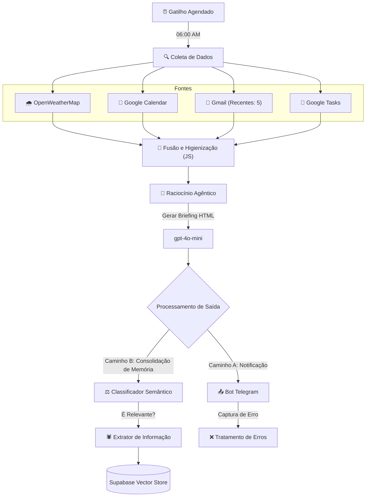

# 🌐 Agente de Briefing Diário Automatizado

Este projeto implementa um agente autônomo no **n8n** que compila um briefing diário hiperpersonalizado. Ele orquestra dados do Google Workspace e OpenWeatherMap, resume as informações usando LLMs e não apenas entrega via Telegram, mas também **consolida o contexto do dia em um Banco de Dados Vetorial** para memória de longo prazo.

---

## 🔧 Arquitetura do Workflow

O sistema segue um pipeline linear de extração com uma estratégia de ramificação de pós-processamento para armazenamento de memória.

---

## 🖇️ Aprofundamento Técnico

### 🔹 1. Ingestão Multi-Fonte

O workflow realiza requisições paralelas para buscar o contexto imediato do usuário:

* **Janela de Contexto:** Filtra eventos do Calendar especificamente para `today()` (hoje).
* **Sumarização Inteligente:** Nós de código personalizados em JavaScript (`Code Nodes`) pré-processam JSONs genéricos do Gmail e Tasks, transformando-os em strings legíveis para economizar tokens da LLM.

### 🔹 2. O Agente "Briefer"

Ao contrário de uma concatenação simples, um Agente de IA (`gpt-4o-mini`) atua como o arquiteto da mensagem. Ele segue um **System Prompt rigoroso em TOON (Token Oriented Object Notation)** para:

* Formatar a saída em HTML compatível com o Telegram (higienizando tags não suportadas).
* Decidir o tom da mensagem com base no perfil do usuário.
* Lidar de forma robusta com estados vazios (ex: "Nenhuma tarefa para hoje").

### 🔹 3. RAG e Memória de Longo Prazo (A Camada "Fantasma")

Após o envio da mensagem, o workflow continua rodando em segundo plano:

1. **Classificação:** Um classificador local determina se o briefing contém contexto histórico valioso.
2. **Embedding Vetorial:** Se relevante, o contexto é vetorizado (usando OpenAI Embeddings) e armazenado no **Supabase (pgvector)**. Isso permite que agentes futuros consultem "O que eu fiz na terça-feira passada?".

---

## 🚀 Como Usar

### 1. Configuração de Ambiente

Você precisa configurar seu nó `Data` ou as Variáveis de Ambiente no n8n:

* `CHAT_ID`: Seu ID de usuário do Telegram.
* `USER_NAME`: Seu primeiro nome (para a persona do Agente).

### 2. Credenciais Necessárias

* **Google Cloud:** OAuth2 para Calendar, Gmail e Tasks.
* **OpenWeatherMap:** Chave de API (API Key).
* **OpenAI / OpenRouter:** Chave de API para a LLM.
* **Supabase:** (Opcional) Para a funcionalidade de Vector Store.

### 3. Execução

O gatilho está definido para **06:00 AM** diariamente. Você pode executar o workflow manualmente para testar a renderização do prompt.

---

## 🛠️ Stack e Dependências

* **Orquestrador:** n8n (Recomendado Self-hosted)
* **LLMs:**
* *Geração:* GPT-4o-mini (OpenAI)
* *Extração:* Gemini 2.5 Flash (via OpenRouter)

* **Banco de Dados:** Supabase (PostgreSQL + pgvector)
* **Linguagens:** TypeScript (nos nós de Code) para transformação de dados.

---

## 🤝 Contribuições

Sinta-se à vontade para abrir issues ou enviar PRs. Este projeto faz parte de um ecossistema maior de "Personal Agentic OS".
